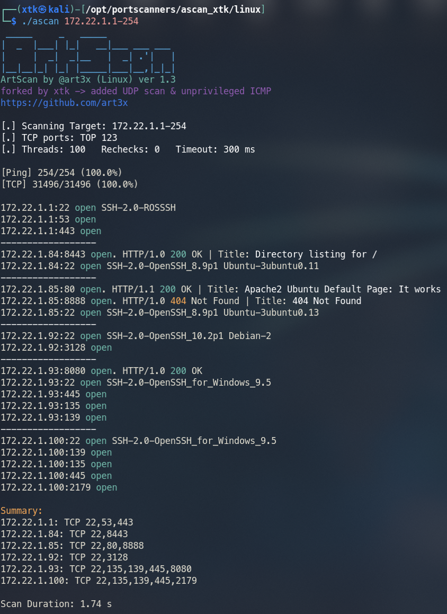
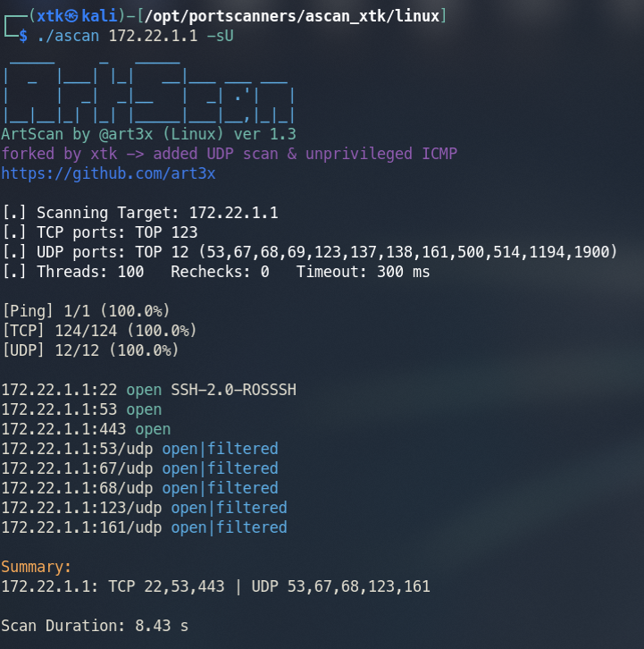

# ArtScan (Linux version)

ArtScan is a tiny, convenient, and very fast port scanner written in C. It is perfect for pentesting and red team engagements. Its size is only 25 KB.

This fork by @xtk adds UDP scanning and unprivileged ICMP (no sudo required on modern Linux).



## Features

* IP ranges and port ranges scan with threads and timeout adjustments
* Super fast smart scan of TOP 124 most common TCP ports by default
* UDP scanning with TOP 12 common UDP ports (DNS, SNMP, NTP, DHCP, etc.)
* No sudo required - uses unprivileged ICMP sockets (Linux 3.0+)
* Scan progress indicator
* Perform ping scan only (skip port scan)
* Capture banners and HTTP responses on open ports
* Scan by IP and FQDN
* Brief, sorted scan summary

## Compile

```bash
gcc -O2 -std=gnu11 -pthread -o ascan ascan.c
```

## Compile static (recommended for portability)

```bash
musl-gcc -O2 -static -pthread ascan.c -o ascan
```

## Usage

```
Usage: ./ascan <target> [ports] [options]
  target:    Hostname (e.g., scanme.nmap.org), single IP, or range (192.168.1.1-100)
  ports:     Single port, range (80-90), comma-separated list (22,80,443), or 'all'
Options:
  -T <num>:  Set thread limit (default: 100)
  -t <ms>:   Set port scan timeout in msec (default: 300)
  -r <num>:  Set extra rechecks for unanswered ports (default: 0)
  -Pn:       Disable ping (skip host discovery)
  -i:        Perform icmp scan only (skip port scan)
  -sU:       Enable UDP scan (uses TOP 12 UDP ports if no ports specified)
  -Nb:       Enable hostname resolution via reverse DNS lookup
  -h:        Display this help message
```

## Examples

```bash
# Basic TCP scan (TOP 124 ports)
./ascan 192.168.1.1

# TCP + UDP scan (TOP 124 TCP + TOP 12 UDP)
./ascan 192.168.1.1 -sU

# Scan specific ports (TCP + UDP)
./ascan 192.168.1.1 22,53,80,161,443 -sU

# Scan IP range
./ascan 192.168.1.1-254

# Skip ping, scan directly
./ascan 10.10.10.10 -Pn

# Ping sweep only
./ascan 192.168.1.1-254 -i
```

## UDP Scanning Notes



Default UDP ports scanned with `-sU`: 53, 67, 68, 69, 123, 137, 138, 161, 500, 514, 1194, 1900

| Port | Service |
|------|---------|
| 53 | DNS |
| 67/68 | DHCP |
| 69 | TFTP |
| 123 | NTP |
| 137/138 | NetBIOS |
| 161 | SNMP |
| 500 | IKE/IPsec |
| 514 | Syslog |
| 1194 | OpenVPN |
| 1900 | SSDP/UPnP |

UDP scanning is inherently slower than TCP due to ICMP rate limiting on target hosts. Results show `open|filtered` because UDP cannot distinguish between an open port that doesn't respond and a filtered port.

## Fork Changes (by @xtk)

- Unprivileged ICMP: Uses `SOCK_DGRAM` ICMP sockets instead of raw sockets - no root/sudo required on Kali and most modern Linux distributions
- UDP scanning: Added `-sU` flag with smart default port list for common UDP services
- Separate port lists: TCP and UDP can use different port lists (UDP defaults to TOP 12 when not specified)

## Credits

Original ArtScan by [@art3x](https://github.com/art3x)
